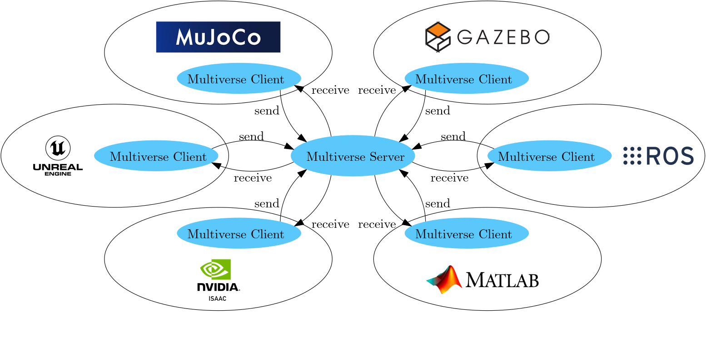

Welcome to Multiverse Framework's documentation!
================================================

**Multiverse Framework** is a system that connects different robotics simulation and hardware components together. It serves as a unifying infrastructure that addresses the fragmentation across simulation and controller software. Instead of being a single simulator extended with controllers and reasoning modules, it provides an architectural foundation with interoperability mechanisms that allow simulators, controllers, and reasoning systems to remain independent while still operating together as a coherent ecosystem.

.. note::

   This project is under active development.

.. raw:: html

   <video src="_static/videos/Multiverse.mp4" width="1200" controls></video>
   

Introduction
------------

The Multiverse software is built with three main pillars: the Multiverse Server/Client, Multiverse Parser, and Multiverse Knowledge. Each pillar operates independently, making separate installation and operation possible. To simplify the launching and visualizing of clusters, Multiverse includes Multiverse Launch and Multiverse View. The software runs on both Linux and Windows, with seamless communication across systems via multiple socket (currently only ZMQ). 

Multiverse Server-Client
~~~~~~~~~~~~~~~~~~~~~~~~

Conceptually, Multiverse Server-Client is like the nervous system of a robot, allowing software and hardware 
to freely share data with one another in real time through a central control station called ``multiverse_server``.

Unlike ROS, Multiverse was created with the goal of integrating different programs as 
**plugins** rather than as **wrappers** like ROS. This means that when a program runs with 
Multiverse, it is almost unaffected—or only minimally affected—by it. The presence of Multiverse 
in each program’s workflow is nearly negligible. This allows software to run at full performance 
without having to dedicate excessive resources to data transmission.

This philosophy is reflected in the following features (some of which are still under development):

- **No external dependencies** → pure logic
- **Interchangeable communication methods** (TCP, UDP, ROS, etc.) → high flexibility
- **Written in C++ with Python bindings** → integrable into any program
- **Plugin structure**: each Multiverse plugin depends only on the Multiverse base class 
  and the target program’s own library → reduces cross-dependencies and simplifies management

In this framework, "simulator" encompasses a broad range of entities, including not only physics engines and graphics engines but also VR headsets that interpret objects geometry, position, and orientation to render them, and controllers that compute forces and torques based on physics data. It can also include Python scripts to manipulate and analyze this data. The possibilities are endless, making it adaptable to many different scenarios. The Multiverse Server-Client is the essential foundation that makes this versatility possible.

Multiverse Parser
~~~~~~~~~~~~~~~~~

One might have concern "Oh but different simulators or software components, each using its own scene description format, can't connect with each other if they aren't compatible, right?". The answer is...

.. raw:: html

    

This is by far one of the most painful problems in the robotics community in particular and in society in general, everyone claims they are the best and compelling others to adopt their "almighty" solution. Although a solution may initially be considered the best, it's only a matter of time before it's surpassed by another. When this transition occurs, all software tools reliant on the outdated solution become obsolete and require significant effort to update. One good example is the URDF format, which is widely used to describe robots, yet lacks sufficient features to be useful beyond Gazebo.

Luckily, there's a solution to this problem. If there were a Nobel Peace Prize for Scene Description Formats, the Universal Scene Description Format (USD) would be the clear winner. USD, as its name implies, acts as a translation medium for different formats, much like the US Dollar in global trade (haha). The key to this versatility lies in USD's extensibility through custom schemas. A schema functions as a container, adding attributes to a USD prim, allowing any new format to be converted into USD with custom schemas, thus enabling bi-directional conversion.

.. raw:: html

   <video src="_static/videos/Multiverse-Parser.mp4" width="1200" controls></video>
   

And in the Multiverse Parser component of the Multiverse framework, USD serves as the translation medium, facilitating not only the seamless conversion of different scene descriptions, but also optimizing them by removing redundant data. This includes visual meshes that are irrelevant to physics engines, and collision meshes that are invisible to graphics engines. You have the meshes but you don't have the proper dynamic properties? Not a problem, Multiverse Parser can compute these properties based on the geometry.

Multiverse Knowledge
~~~~~~~~~~~~~~~~~~~~

Running a physics simulation is fun and enjoyable for humans, particularly in video games, films, and education. If you think about it, the reason it's fun is because you can see what you imagine. State-of-the-art VR technologies also help immerse you in a world of imagination, where you can do whatever you want, even in unrealistic places such as the middle of the sun or in a fancy car surrounded by beautiful partners. Imagination is a powerful feature that has led us to where we are now, and in AI and robotics, we aim to enable this feature in robots.

The world is changing, moving from 2D to 3D data. While classification and semantic labeling of images and videos are commonplace, they remain in 2D. The transition to 3D data is not trivial. First, AI demands vast amounts of data, and 3D data is scarcer than 2D, with its capture being more challenging. While everyone has a smartphone and can take photos, how many people have a VR headset and want to scan an object in 3D? Second, 3D data offers layering, making the hidden parts of an object visible, increasing the data size compared to 2D's single layer from a camera capture. Third, data incompatibility further complicates the process.

The Multiverse Knowledge addresses this by taking the first step in understanding scene descriptions and translating them into a machine-readable scene graph. By converting different scene descriptions into USD using the Multiverse Parser, the Multiverse Knowledge transforms the USD scene into a semantic one, adapting custom schemas that support semantic labeling of each USD prim with ontological concepts from various ontologies. This process can be done manually or automatically using the Multiverse View. In summary, given a scene description in any format and some ontologies, the Multiverse Knowledge converts it into a knowledge graph that can be queried. Extending the example of imagination, you can now even interact with the 3D environment verbally.

Acknowledgements
~~~~~~~~~~~~~~~~

This work has been (partially) supported by:

* The European Union's Horizon Europe Framework Programme under grant agreement No 101070596.
* The German Research Foundation (DFG), as part of Collaborative Research Center (Sonderforschungsbereich) 1320, Project-ID 329551904, "EASE - Everyday Activity Science and Engineering", University of Bremen (`ease-crc.org <http://ease-crc.org/>`_). The research was conducted in subproject R03.
* The German Federal Ministry for Economic Affairs and Climate Action (BMWK) as a part of the Knowledge4Retail project.

Contents
--------

.. toctree::
   :maxdepth: 1

   tutorials
   api
