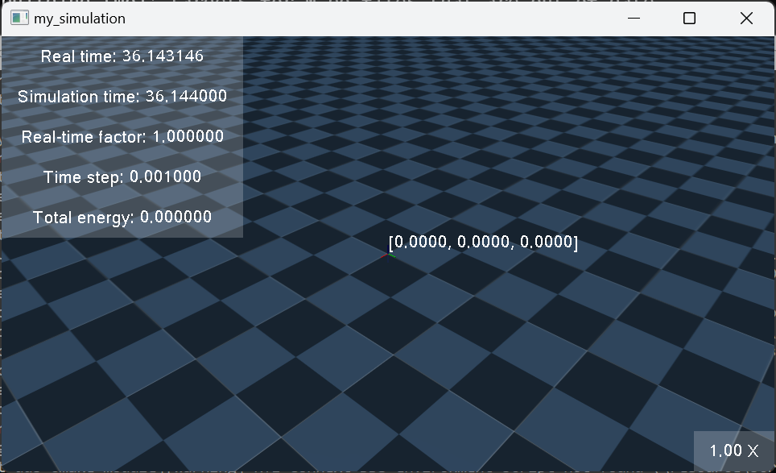

.. _tutorial_2:

Tutorial 2: Running one world with multiple simulators
======================================================

Introduction
------------

In this tutorial, we will cover how to run one world with multiple simulators.
In Multiverse, you could define multiple simulations for a world and connect them to each other to simulate complex interactions between different objects accross different simulators.
This decentralized approach allows you to run multiple simulations in parallel to save resources when dealing with simulators with different time steps, running in different platforms or requiring different computational resources.

Getting Started
---------------

1. Create a new MUV file `my_project.muv` in `<path/to/Multiverse>/multiverse/resources/muv` and open it in your favorite text editor. This file will contain the configuration for your Multiverse project.

Define Resources, Worlds, and Simulations
-----------------------------------------

2. Add the following lines to the MUV file to specify the resources and worlds for your project:

.. code-block:: yaml

    resources: 
    - ../robots             # Path to the robots directory, containing robot models in any formats
    - ../worlds             # Path to the worlds directory, containing world models in any formats
    - ../objects            # Path to the objects directory, containing object models in any formats
  
    worlds:
        my_world:           # Name of the world
            rtf_desired: 1  # Real-time factor desired for the simulation
  
1. Add the following lines to the MUV file to define the simulations for your project:

.. code-block:: yaml

    simulations:
        bowling_simulation:
            simulator: mujoco
            world:
                name: world
                path: table_with_bowling/bowling.xml

        table_simulation:
            simulator: mujoco
            world:
                name: world
                path: table_with_bowling/table.xml

        cube_simulation:
            simulator: mujoco
            world:
                name: world
                path: table_with_bowling/cube.xml

        table_with_bowling_simulation:
            simulator: mujoco
            world:
                name: world
                path: table_with_bowling/table_with_bowling.xml

4. Save the MUV file and test the simulations.

.. code-block:: bash

    multiverse_launch <path/to/Multiverse>/multiverse/resources/muv/my_project.muv

Four simulations will be launched: `bowling_simulation`, `table_simulation`, `cube_simulation`, and `table_with_bowling_simulation`. Each simulation will run in its own window. But they are not connected to each other yet. 
In the next step, we will connect them by defining the communication between the simulators.

Define Communication Between Simulators
----------------------------------------

5. Add the following lines to the MUV file to define the Multiverse Server:

.. code-block:: yaml

    multiverse_server:
        host: "tcp://127.0.0.1"     # Host IP address
        port: 7000                  # Port number

6. Add the following lines to the MUV file to define the Multiverse Clients:

.. code-block:: yaml
    
    multiverse_clients:
        table_with_bowling_simulation:
            port: 7501
            send:
                cursor: ["position", "quaternion"]
                bowling: ["force", "torque"]
                table: ["force", "torque"]
            receive:
                bowling: ["relative_velocity", "position", "quaternion"]
                table: ["relative_velocity", "position", "quaternion"]
                cube: ["relative_velocity", "position", "quaternion"]

        bowling_simulation:
            port: 7502
            send:
                bowling: ["relative_velocity", "position", "quaternion"]
            receive:
                cursor: ["position", "quaternion"]
                bowling: ["force", "torque"]

        table_simulation:
            port: 7503
            send:
                table: ["relative_velocity", "position", "quaternion"]
            receive:
                cursor: ["position", "quaternion"]
                table: ["force", "torque"]

        cube_simulation:
            port: 7504
            send:
                cube: ["relative_velocity", "position", "quaternion"]
            receive:
                cursor: ["position", "quaternion"]

7. Save the MUV file and test the simulations.

.. code-block:: bash

    multiverse_launch  <path/to/Multiverse>/multiverse/resources/muv/my_project.muv

The four simulations will be launched and connected to each other. You can now see the interactions between the simulators in real-time.
In this configuration, `table_with_bowling_simulation` simulates the contact between the table, the cubes and the bowling ball by taking the poses and relative velocities of the objects from the other simulations as input and sending the forces and torques to the other simulations as output. 
The `bowling_simulation`, `table_simulation`, and `cube_simulation` simulate the individual behaviors of the bowling ball, the table, and the cubes, respectively. Each simulation sends the poses and relative velocities of the objects to the `table_with_bowling_simulation` and receives the forces and torques from it.

Conclusion
----------

Congratulations! You have successfully run one world with multiple simulators in Multiverse. In this tutorial, you learned how to define resources, worlds, simulations, and communication between simulators in a MUV file and launch the simulations using the `multiverse_launch` command.

Next Steps
----------

- Adding robots and objects to the simulations.