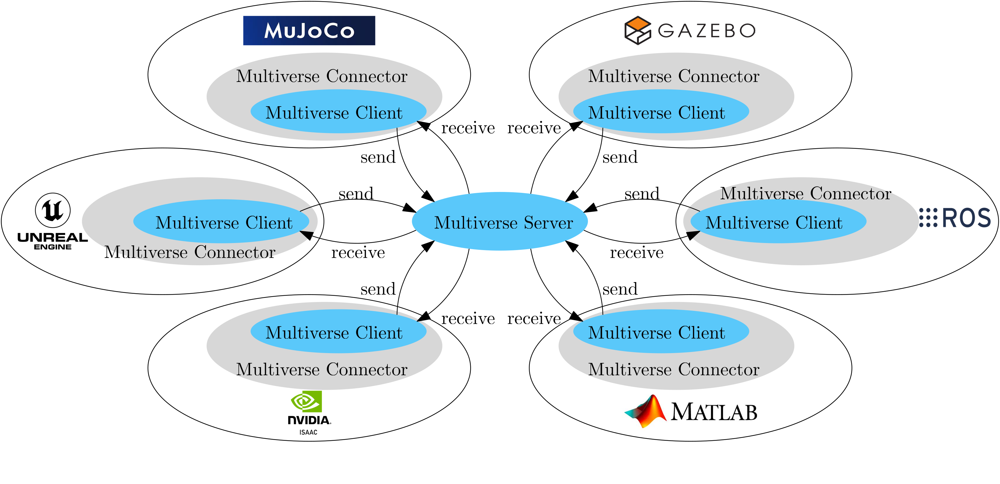
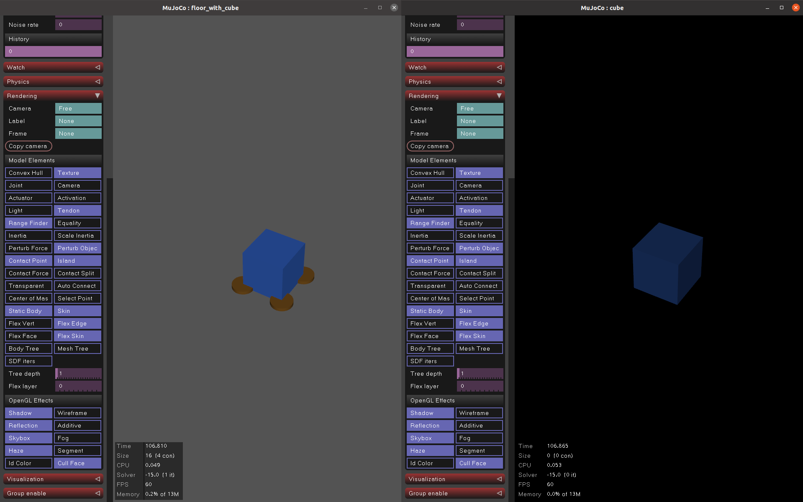

.. _tutorial_2:

Tutorial 2: Multiverse Connector in MuJoCo
==========================================

Introduction
------------

Welcome to the second tutorial of the Multiverse Framework! In this tutorial, you will learn how to integrate the Multiverse Connector into a MuJoCo simulation as a plugin.  

.. important::

   **Zero-install experience:** You don’t need to install anything system-wide.
   Just **download the prebuilt package** and run it. No dependencies, no setup.

In this tutorial, you will:

- Start the Multiverse Server
- Define simple MJCF environments with the Multiverse Connector as a plugin  
- Run the MuJoCo simulation — the Multiverse Connector plugin will handle the connection to the Multiverse Server and keep data flowing in real time.

Key Concepts
------------

- **Multiverse Server**: The central hub that coordinates communication between simulators
  and controllers in real time.
- **Multiverse Client**: A base program (C++ with Python bindings) that connects to the
  Multiverse Server to send and receive data.
- **Multiverse Connector**: A specific implementation of a Multiverse Client that connects to a particular simulator or controller.

Getting Started
---------------

1. Clone **or download** the following repositories to your local machine:

.. code-block:: bash

    git clone https://github.com/Multiverse-Framework/Multiverse-ServerClient.git
    git clone https://github.com/Multiverse-Framework/Multiverse-MuJoCo-Connector.git

.. note::

    **No Git?** Open each repository on GitHub, click **Code → Download ZIP**,
    and extract the archives locally.

2. Verify that MuJoCo is installed. You can also download a prebuilt package directly from the `MuJoCo releases page <https://github.com/google-deepmind/mujoco/releases>`_.

.. note::
    Make sure to download the package that matches your operating system and architecture.

Example downloads:

- `MuJoCo 3.3.5 for Linux (x86_64) <https://github.com/google-deepmind/mujoco/releases/download/3.3.5/mujoco-3.3.5-linux-x86_64.tar.gz>`_  
- `MuJoCo 3.3.5 for Windows (x86_64) <https://github.com/google-deepmind/mujoco/releases/download/3.3.5/mujoco-3.3.5-windows-x86_64.zip>`_ 

After downloading, **extract the package** and run the simulator binary to verify that MuJoCo starts correctly.  

- On Linux/macOS:  

.. code-block:: bash  

    ./bin/simulate  

- On Windows (PowerShell or CMD):  

.. code-block:: powershell  

    .\bin\simulate.exe  

By default, MuJoCo will also load its prebuilt plugins and display them in the terminal, for example:  

.. code-block:: text  

    MuJoCo version 3.3.5  
    Plugins registered by library 'libactuator.so':  
        mujoco.pid  
    Plugins registered by library 'libelasticity.so':  
        mujoco.elasticity.cable  
    Plugins registered by library 'libsdf_plugin.so':  
        mujoco.sdf.bolt  
        mujoco.sdf.bowl  
        mujoco.sdf.gear  
        mujoco.sdf.nut  
        mujoco.sdf.torus  
    Plugins registered by library 'libsensor.so':  
        mujoco.sensor.touch_grid  

.. note::  
    If MuJoCo is working correctly, a **simulation window** will open showing a simple 3D scene  
    (often with the MuJoCo logo or demo model). You can close the window once you have confirmed it launches.  

3. Enable the Multiverse Connector plugin:

Locate the Multiverse Connector plugin in ``Multiverse-MuJoCo-Connector/mujoco_plugin/mujoco-<mujoco_version>`` (for example: ``mujoco-3.3.5``).

On Linux/macOS, the file is: ``libmultiverse_connector.so``.

On Windows, the file is: ``multiverse_connector.dll``.

Copy this file into your MuJoCo installation at ``<mujoco_root>/bin/mujoco_plugin`` (e.g. ``mujoco-3.3.5/bin/mujoco_plugin`` — at the same level as the ``simulate`` binary).  

.. note::
    If the ``mujoco_plugin`` directory does not exist, create it manually before copying the file.

After copying, you can verify that the Multiverse Connector plugin is loaded by running the ``simulate`` binary again. You should see output similar to the following in the terminal:

.. code-block:: text  

    MuJoCo version 3.3.5
    Plugins registered by library 'libactuator.so':
        mujoco.pid
    Plugins registered by library 'libelasticity.so':
        mujoco.elasticity.cable
    Plugins registered by library 'libsdf_plugin.so':
        mujoco.sdf.bolt
        mujoco.sdf.bowl
        mujoco.sdf.gear
        mujoco.sdf.nut
        mujoco.sdf.torus
    Plugins registered by library 'libmultiverse_connector.so': <-- Multiverse Connector plugin successfully loaded
        mujoco.multiverse_connector
    Plugins registered by library 'libsensor.so':
        mujoco.sensor.touch_grid

.. note::  
   If you do **not** see the line with ``libmultiverse_connector.so`` and  
   ``mujoco.multiverse_connector``, it means the plugin was not copied correctly or is incompatible with your MuJoCo version.  
   In this case, double-check that you have the correct version of the plugin for your MuJoCo installation and operating system.
   Make sure the file is placed in ``<mujoco_root>/bin/mujoco_plugin`` and restart MuJoCo.

4. Start the Multiverse Server by running the following command in a terminal:

.. code-block:: bash

    cd <path/to/Multiverse-ServerClient>/bin
    ./multiverse_server

The Multiverse Server should now be running and waiting for Multiverse Clients to connect. The default port is `7000`.
The following output should appear in the terminal:

.. code-block:: text

    Start Multiverse Server...
    [Server] Create server socket tcp://*:7000
    [Server] Waiting for request...

5. Create a new MJCF environment that uses the Multiverse Connector plugin.

For this tutorial, we will build a minimal example: a single cube that falls under gravity  
while sending its position, orientation, and velocity data to the Multiverse Server.

.. code-block:: xml  

    <mujoco model="cube">
        <option gravity="0 0 -9.81" timestep="0.001"/>

        <worldbody>
            <body name="cube" pos="0 0 1">
                <geom name="cube_geom" type="box" size="0.05 0.05 0.05" rgba="0.2 0.4 0.8 1"/>
                <freejoint/>
            </body>
        </worldbody>

        <extension>
            <plugin plugin="mujoco.multiverse_connector">
                <instance name="mujoco_client">
                    <config key="host" value="tcp://127.0.0.1" />
                    <config key="server_port" value="7000" />
                    <config key="client_port" value="7500" />
                    <config key="world_name" value="world" />
                    <config key="simulation_name" value="mujoco_sim" />
                    <config key="send" value="{'cube': ['position', 'quaternion', 'linear_velocity', 'angular_velocity']}" /> <!-- Data to send to the Multiverse Server -->
                </instance>
            </plugin>
        </extension>
    </mujoco>

Save this file as ``cube.xml`` inside your working directory.

6. Run the MuJoCo simulation with the Multiverse Connector plugin:

.. code-block:: bash

    ./bin/simulate </path/to/>cube.xml

The MuJoCo simulation window should open, and you should see a cube falling under gravity while the Multiverse Connector plugin sends its state data to the Multiverse Server.

Now this simulation is quite boring, but you can connect this simulation to another one that sends force and torque to the cube to make it stop falling.

7. Connect two MuJoCo simulations using the Multiverse Connector plugin.

Edit the ``cube.xml`` file to receive force and torque data from the Multiverse Server:

.. code-block:: xml  

    <mujoco model="cube">
        <option gravity="0 0 -9.81" timestep="0.001"/>

        <worldbody>
            <body name="cube" pos="0 0 1">
                <geom name="cube_geom" type="box" size="0.05 0.05 0.05" rgba="0.2 0.4 0.8 1"/>
                <freejoint/>
            </body>
        </worldbody>

        <extension>
            <plugin plugin="mujoco.multiverse_connector">
                <instance name="multiverse_connector">
                    <config key="host" value="tcp://127.0.0.1" />
                    <config key="server_port" value="7000" />
                    <config key="client_port" value="7501" />
                    <config key="world_name" value="world" />
                    <config key="simulation_name" value="cube_sim" />
                    <config key="send" value="{'cube': ['position', 'quaternion', 'linear_velocity', 'angular_velocity']}" /> <!-- Data to send to the Multiverse Server -->
                    <config key="receive" value="{'cube': ['force', 'torque']}" /> <!-- Data to receive from the Multiverse Server -->
                </instance>
            </plugin>
        </extension>
    </mujoco>

Create a new MJCF file named ``floor_with_cube.xml`` with a floor and a cube, this cube will receive the state data from the first simulation and send force and torque to it, when the cube touches the floor, it will apply an upward force to stop the cube from falling.

.. code-block:: xml  

    <mujoco model="floor_with_cube">
        <option gravity="0 0 -9.81" timestep="0.01"/>

        <worldbody>
            <geom name="floor" type="plane" size="0 0 0.1" rgba="0.9 0.9 0.9 1"/>
            <body name="cube" pos="0 0 1">
                <geom name="cube_geom" type="box" size="0.05 0.05 0.05" rgba="0.2 0.4 0.8 1"/>
                <freejoint/>
            </body>
        </worldbody>

        <extension>
            <plugin plugin="mujoco.multiverse_connector">
                <instance name="multiverse_connector">
                    <config key="host" value="tcp://127.0.0.1" />
                    <config key="server_port" value="7000" />
                    <config key="client_port" value="7502" />
                    <config key="world_name" value="world" />
                    <config key="simulation_name" value="floor_with_cube_sim" />
                    <config key="send" value="{'cube': ['force', 'torque']}" /> <!-- Data to send to the Multiverse Server --> <!-- Data to send to the Multiverse Server -->
                    <config key="receive" value="{'cube': ['position', 'quaternion', 'linear_velocity', 'angular_velocity']}" /> <!-- Data to receive from the Multiverse Server -->
                </instance>
            </plugin>
        </extension>
    </mujoco>

Now run two MuJoCo simulations in separate terminal windows (order does not matter):

.. code-block:: bash

    ./bin/simulate </path/to/>cube.xml

.. code-block:: bash

    ./bin/simulate </path/to/>floor_with_cube.xml

You should see two MuJoCo simulation windows open: one with a falling cube and another with a floor and a cube. 
When the falling cube touches the floor, it should stop falling due to the upward force applied by the second simulation.

.. note::  

    - You can reset the simulation by hitting **Backspace** in any window. A reset in one simulation will automatically trigger a reset in the other.
    
    - You can extend this setup by adding more simulations with additional objects and linking them together in the same way.  
    
    - Ensure that all simulations share the same ``world_name``, but use a unique ``simulation_name`` and ``port`` for each instance; otherwise, conflicts will cause a crash (each ``simulation_name`` must map to a distinct port).  

    - You can also connect these simulations with the **Multiverse Connector** introduced in the previous Python tutorial, enabling real-time data exchange between them.

Conclusion
----------

Congratulations! You have successfully integrated the Multiverse Connector plugin into MuJoCo simulations and connected multiple simulations and exchanged data in real time through the Multiverse Server.

Next Steps
----------

- Use Multiverse Connector in Unreal Engine as a plugin: :ref:`tutorial_3`
