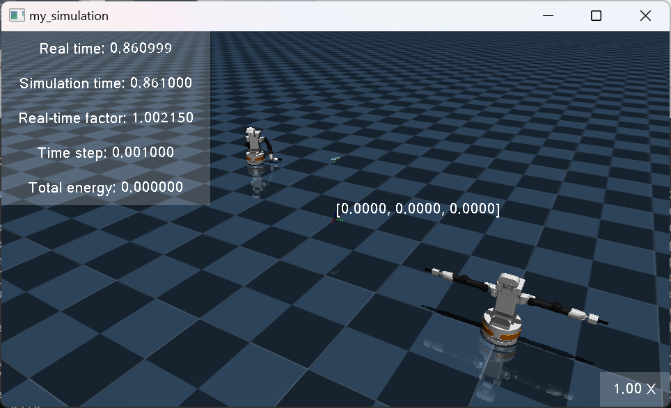

.. _tutorial_3:

Tutorial 3: Adding robots and objects to the simulation
=======================================================

Introduction
------------

In this tutorial, we will cover how to add robots and objects to the simulation in a world in Multiverse.

Getting Started
---------------

1. Open the MUV file `my_project.muv` that you created in :ref:`tutorial_1` in your favorite text editor.

Define Robots and Objects in the MUV file
-----------------------------------------

1. Modify the MUV file to add robots and objects to the simulation in the world:

.. code-block:: yaml

    simulations:
        my_simulation:
            simulator: mujoco
            world:
                name: my_world
                path: floor.xml
            robots:
                tiago_dual_1:                           # Name of the robot
                    path: tiago_dual_no_controller.xml  # Path to the robot model file in the robots directory
                    apply:                              # Apply properties to the robot model, such as position, orientation, and gravity compensation
                        body:                           # Apply properties to the body of the robot
                            tiago_dual:                 # Name of the body to apply properties, this should match the body name in the robot model file
                                pos: [1, 2, 0]          # Position of the body in the world
                            gravcomp: 1                 # Enable gravity compensation for the robot
                    disable_self_collision: auto        # Disable self-collision for the robot, auto means that all initally colliding pairs are disabled
                    suffix:                             # Add suffix to the robot components to avoid name conflicts
                        body: _1
                        geom: _1
                        joint: _1
                        position: _1
                tiago_dual_2:
                    path: tiago_dual_no_controller.xml
                    apply:
                        body:
                            tiago_dual:
                                pos: [-1, -2, 0]
                    disable_self_collision: auto
                    suffix:
                        body: _2
                        geom: _2
                        joint: _2
                        position: _2

            objects:
                milk_box:
                    path: milk_box.xml
                apply:
                    body:
                        milk_box:
                            pos: [0.0, 0.0, 5.0]
                            quat: [0, 0.707, 0, 0.707]

1. Save the MUV file, and you are ready to launch your simulation with robots and objects in Multiverse.

Running the Simulation
----------------------

.. code-block:: bash

    multiverse_launch  <path/to/Multiverse>/multiverse/resources/muv/my_project.muv

The simulation will be launched with the robots `tiago_dual_1` and `tiago_dual_2` and the object `milk_box` in the world. 
The robots and objects will be placed at the specified positions and orientations in the world, `tiago_dual_1` at `[1, 2, 0]` with gravitation compensation and `tiago_dual_2` at `[-1, -2, 0]` without gravitation compensation,
and the object `milk_box` will be placed with the specified quaternion `[0, 0.707, 0, 0.707]`, being dropped from a height of 5.0 units.

Conclusion
----------

Congratulations! You have successfully added robots and objects to the simulation in Multiverse.

Next Steps
----------

- Deploy ROS as Multiverse Clients to interact with the simulation.