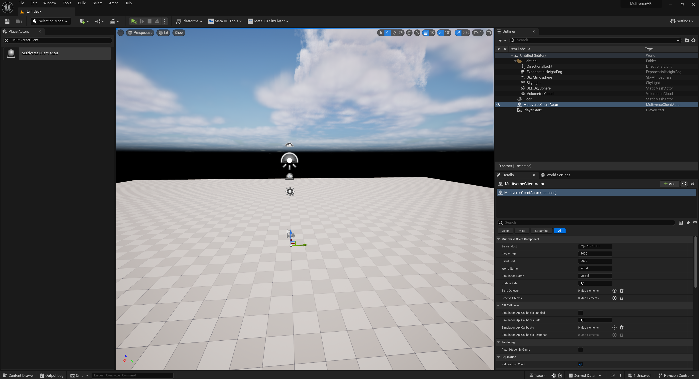
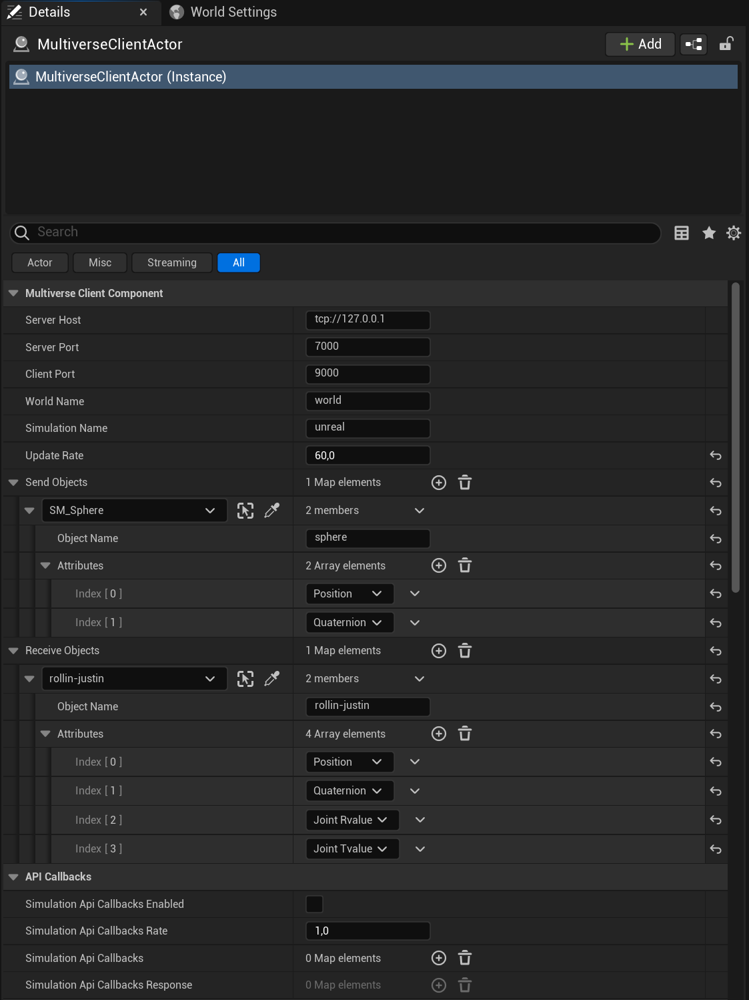

.. _tutorial_4:

Tutorial 4: Adding robots and objects to the simulation - Unreal Engine
=======================================================================

Introduction
------------

In this tutorial, we will cover how to add robots and objects to the Unreal Engine simulation in a world in Multiverse.

.. note::
    
   Because the Unreal Engine simulator running on Linux does not support VR functionalities, this tutorial is only available for Windows.

.. note::

   At the moment, this API in Unreal Engine simulator only supports parts of Multiverse functionalities. Support for the full Multiverse functionalities will be added in the future.

Getting Started
---------------

1. Create an Unreal Engine project and add to the `Plugins` folder the following plugins:

- `MultiverseConnector <https://github.com/Multiverse-Framework/Multiverse-UnrealEngine-Connector>`_
- `Meta XR Plugin v60 <https://developer.oculus.com/downloads/package/unreal-engine-5-integration/60.0>`_
- `Meta XR Platform v60 <https://developer.oculus.com/downloads/package/unreal-5-platform-sdk-plugin/60.0>`_

2. Build the Unreal Engine project and open it with Unreal Editor.

3. In the Unreal Editor, place the `MultiverseClientActor` actor from the `PlaceActors` panel in the level.

Define Robots and Objects in the `MultiverseClientActor`
--------------------------------------------------------

4. In the Unreal Editor, drag some robots and objects from the `Content Browser` to the level. Some examples of robots and objects can be found in the `Content Browser` under the `Plugins\Multiverse-UnrealEngine-Connector\Content` folder.

.. note::

    For the skeletal meshes, make sure to set the `Anim Class` property to the corresponding animation blueprint (inherits from `Multiverse Anim`). Tutorial for creating a custom animation blueprint for the robot will be added later.

.. image:: ../_static/images/tutorials/tutorial_4_2.png
   :width: 1200

5. In the `MultiverseClientActor` actor, add robots and objects to the corresponding fields.

6. Save the Unreal Engine project.

Running the Simulation
----------------------

.. note::

    Before running the simulation, make sure the Multiverse Server is running.

To start the Multiverse Server, run the following command in the terminal:

.. code-block:: bash

    multiverse_server

7. Run the Unreal Engine project.

At this point, you should see connection between the Unreal Engine simulation and the Multiverse Server. 
In this example, Unreal Engine will send the object position and quaternion to the Multiverse Server, and the Multiverse Server will send the robot state, including position, quaternion and the joint state to the Unreal Engine simulation.
To successfully control the robot, you need to deploy another Multiverse Client to simulate the robot and send the robot state to the Multiverse Server.

Conclusion
----------

Congratulations! You have successfully added robots and objects to the Unreal Engine simulation in Multiverse.

Next Steps
----------

- Deploy ROS as Multiverse Clients to interact with the simulation.