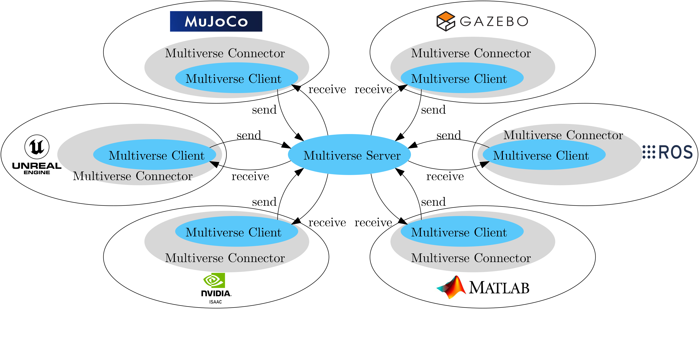
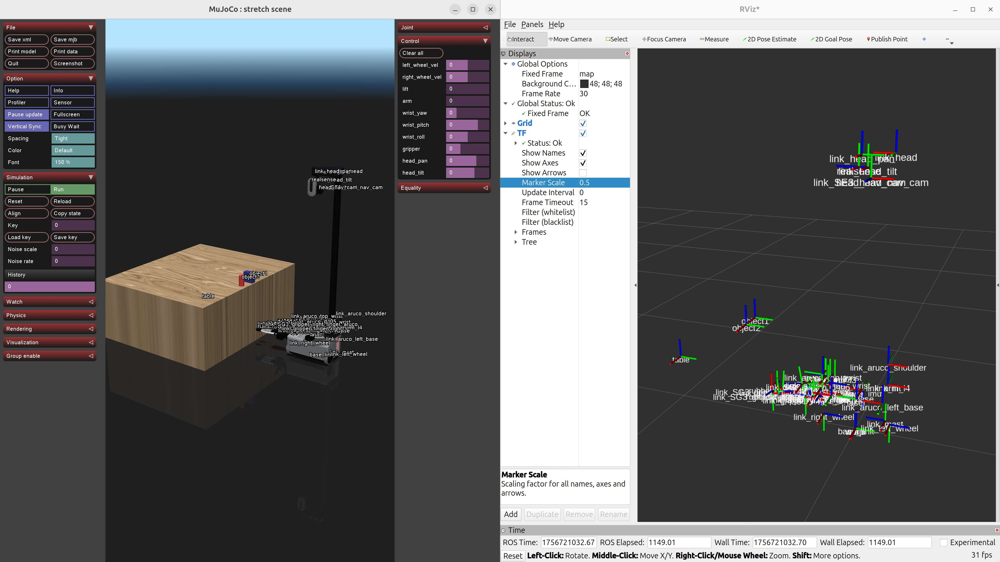
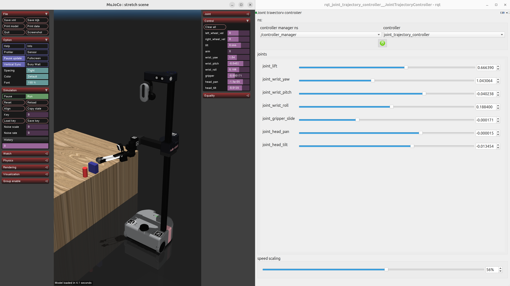

.. _tutorial_6:

Tutorial 6: Multiverse Connector in ROS
=======================================

This tutorial demonstrates how to use the Multiverse Connector in a ROS (Robot Operating System) environment. 

.. important::

   **ROS experience:** This tutorial assumes you have basic knowledge of `ROS <https://www.ros.org/>`_ and have it installed on your system.

In this tutorial, you will:

- Start the Multiverse Server
- Start a robot simulation in MuJoCo with the Multiverse Connector plugin
- Run ROS nodes as Multiverse Connectors to interact with the simulation  
- Use `ros_control <http://wiki.ros.org/ros_control>`_ / `ros2_control <https://control.ros.org/jazzy/index.html>`_ controllers to operate the robot through Multiverse Control as hardware interfaces

.. note::

   This tutorial uses MuJoCo as the simulation environment, but you can choose any simulator that has Multiverse Connector plugins 
   (see `Unreal Engine <tutorial_3.html>`_, `Isaac Sim <tutorial_4.html>`_ and `Gazebo <tutorial_5.html>`_ tutorials).

Key Concepts
------------

- **Multiverse Server**: The central hub that coordinates communication between simulators
  and controllers in real time.
- **Multiverse Client**: A base program (C++ with Python bindings) that connects to the
  Multiverse Server to send and receive data.
- **Multiverse Connector**: A specific implementation of a Multiverse Client that connects to a particular simulator or controller.

Getting Started
---------------

1. Clone **or download** the following repositories to your local machine:

.. code-block:: bash

	git clone https://github.com/Multiverse-Framework/Multiverse-ServerClient.git
	git clone https://github.com/Multiverse-Framework/Multiverse-ClientPy.git
	git clone https://github.com/Multiverse-Framework/Multiverse-ROS-Connector.git

.. note::

	**No Git?** Open each repository on GitHub, click **Code → Download ZIP**,
	and extract the archives locally.

2. Build the ROS workspace for the Multiverse ROS Connector:

For **ROS1 (Noetic):**

.. code-block:: bash
	
	cd <path/to/Multiverse-ROS-Connector>/ros_ws/multiverse_ws
	rosdep install --from-paths src --ignore-src -r -y
	catkin build   # or catkin_make

For **ROS2 (Foxy, Humble, Jazzy):**

.. code-block:: bash
	
	cd <path/to/Multiverse-ROS-Connector>/ros_ws/multiverse_ws2
	rosdep install --from-paths src --ignore-src -r -y
	colcon build --symlink-install

Start the Multiverse Server
---------------------------

3. Start the Multiverse Server by running the following command in a terminal:

.. code-block:: bash

    cd <path/to/Multiverse-ServerClient>/bin
    ./multiverse_server

The Multiverse Server should now be running and waiting for Multiverse Clients to connect. The default port is `7000`.
The following output should appear in the terminal:

.. code-block:: text

    Start Multiverse Server...
    [Server] Create server socket tcp://*:7000
    [Server] Waiting for request...

Start a Robot Simulation with the Multiverse Connector Plugin
-------------------------------------------------------------

4. Choose a robot model from the `MuJoCo Menagerie <https://github.com/google-deepmind/mujoco_menagerie>`_ and download it locally.  

In this tutorial, we use the `Hello Robot Stretch 3 <https://github.com/google-deepmind/mujoco_menagerie/tree/main/hello_robot_stretch_3>`_ model, but you can use *any* MuJoCo model.  

Append the following XML snippet to the end of the MuJoCo model file (e.g. `scene.xml <https://github.com/google-deepmind/mujoco_menagerie/blob/main/hello_robot_stretch_3/scene.xml>`_) to enable the Multiverse Connector plugin:

.. code-block:: xml

    <extension>
        <plugin plugin="mujoco.multiverse_connector">
            <instance name="mujoco_client">
                <config key="host" value="tcp://127.0.0.1" />
                <config key="server_port" value="7000" />
                <config key="client_port" value="7500" />
                <config key="world_name" value="world" />
                <config key="simulation_name" value="scene_simulation" />
                <config key="send" value="{'body': ['position', 'quaternion'], 'joint': ['joint_angular_position', 'joint_linear_position', 'joint_angular_velocity', 'joint_linear_velocity', 'joint_force', 'joint_torque'], 'sensor': ['scalar']}" />
            </instance>
        </plugin>
    </extension>

This configuration streams all body poses, joint states (positions, velocities, forces, torques), and sensor data to the Multiverse Server.  
You can customize the `send` parameter to include or exclude specific data.  

5. Start the MuJoCo simulation with the Multiverse Connector plugin (ensure MuJoCo is installed and the plugin is properly configured, see `<tutorial_2.html#getting-started>`_):

.. code-block:: bash

    <path/to/mujoco>/bin/simulate <path/to/your/model>/scene.xml

The simulation should now be running and transmitting data to the Multiverse Server.

Start the Multiverse Connector in ROS
-------------------------------------

6. Launch the ROS node for the Multiverse Connector in a new terminal.

First, extend your `PYTHONPATH` with the `multiverse_client_py` package:

.. code-block:: bash

    export PYTHONPATH=$PYTHONPATH:<path/to/Multiverse-ClientPy>

Next, source the corresponding ROS workspace:

For **ROS1 (Noetic):**

.. code-block:: bash

    cd <path/to/Multiverse-ROS-Connector>
    source ros_ws/multiverse_ws/devel/setup.bash

For **ROS2 (Foxy, Humble, Jazzy):**

.. code-block:: bash

    cd <path/to/Multiverse-ROS-Connector>
    source ros_ws/multiverse_ws2/install/setup.bash

Finally, start a ROS node that publishes the tf tree for the full environment:

.. code-block:: bash

    python3 scripts/multiverse_ros_run.py --publishers="{'tf': [{'meta_data': {'world_name': 'world', 'length_unit': 'm', 'angle_unit': 'rad', 'mass_unit': 'kg', 'time_unit': 's', 'handedness': 'rhs'}, 'port': 7300, 'topic': '/tf', 'rate': 60, 'root_frame_id': 'map'}]}"  --subscribers="{}"

This command connects to the Multiverse Server on port **7300** and publishes the tf tree to the `/tf` topic at **60 Hz**.  
You can extend the `--publishers` and `--subscribers` arguments to integrate other ROS nodes.  

For more details, see `multiverse_publishers <https://github.com/Multiverse-Framework/Multiverse-ROS-Connector/tree/main/src/multiverse_ros_socket/multiverse_node/multiverse_publishers>`_ and `multiverse_subscribers <https://github.com/Multiverse-Framework/Multiverse-ROS-Connector/tree/main/src/multiverse_ros_socket/multiverse_node/multiverse_subscribers>`_.

7. (Optional) Visualize the robot in RViz (for ROS1) or RViz2 (for ROS2):

For **ROS1 (Noetic):**

.. code-block:: bash

	source /opt/ros/noetic/setup.bash
	rosrun rviz rviz

For **ROS2 (Foxy, Humble, Jazzy):**

.. code-block:: bash

	source /opt/ros/<distro>/setup.bash
	ros2 run rviz2 rviz2

Add a `TF` display in RViz and set its topic to `/tf` to visualize the robot’s pose in real time.  
The visualization should look like this:

Controlling the Robot with ros_control / ros2_control
-----------------------------------------------------

8. Modify the `extension` section of the MuJoCo model file to writing actuators for the robot joints.

.. code-block:: xml

    <extension>
        <plugin plugin="mujoco.multiverse_connector">
            <instance name="mujoco_client">
                <config key="host" value="tcp://127.0.0.1" />
                <config key="server_port" value="7000" />
                <config key="client_port" value="7500" />
                <config key="world_name" value="world" />
                <config key="simulation_name" value="scene_simulation" />
                <config key="send" value="{'body': ['position', 'quaternion'], 'joint': ['joint_angular_position', 'joint_linear_position', 'joint_angular_velocity', 'joint_linear_velocity', 'joint_force', 'joint_torque'], 'sensor': ['scalar']}" />
				<config key="receive" value="{'lift': ['cmd_joint_angular_position'], 'arm': ['cmd_joint_angular_position'], 'wrist_yaw': ['cmd_joint_angular_position'], 'wrist_pitch': ['cmd_joint_angular_position'], 'wrist_roll': ['cmd_joint_angular_position'], 'gripper': ['cmd_joint_linear_position'], 'head_pan': ['cmd_joint_angular_position'], 'head_tilt': ['cmd_joint_angular_position']}" />
			</instance>
        </plugin>
    </extension>

The `receive` parameter defines which actuator commands are accepted for the robot joints.  
Ensure that the actuator types match the joint definitions in your robot model (e.g., use `cmd_joint_angular_position` for revolute joints, `cmd_joint_linear_position` for prismatic joints, and `scalar` for tendons).

Restart the MuJoCo simulation to apply the updated configuration:

.. code-block:: bash

    <path/to/mujoco>/bin/simulate <path/to/your/model>/scene.xml

The Multiverse Server should now be waiting for controller commands.

9. Control the robot with `ros_control <http://wiki.ros.org/ros_control>`_ or `ros2_control <https://control.ros.org/jazzy/index.html>`_:

To set up either `ros_control` or `ros2_control`, you need at least two configuration files:

- **Robot Description (URDF or XACRO):**  
  Defines the robot’s physical structure (links, joints, etc.).  
  This must be consistent with the robot used in the MuJoCo simulation—at minimum, the controlled joint names must match.  

- **Controller Configuration (YAML):**  
  Specifies which controllers to run (e.g., position, velocity, or effort controllers).  

For **ROS1 (Noetic)** with `ros_control`: not documented yet.

For **ROS2 (Foxy, Humble, Jazzy)** with `ros2_control`:

	In this tutorial, we use the following **URDF** and **YAML** files for the `Hello Robot Stretch 3` model:

	- **URDF file:** `stretch.urdf <../_static/others/stretch.urdf>`_
	- **YAML file:** `stretch_ros2_control.yaml <../_static/others/stretch_ros2_control.yaml>`_

	Download these files and modify them as needed for your robot model.

		Publish the robot description to the ROS topic `/robot_description` in a new terminal:

		.. code-block:: bash
			
			source /opt/ros/<distro>/setup.bash
			ros2 run robot_state_publisher robot_state_publisher --ros-args -p robot_description:="$(xacro <path/to/your/urdf>stretch.urdf)"

		Launch the controllers using the `controller_manager` in another terminal:

		.. code-block:: bash
			
			source <path/to/Multiverse-ROS-Connector>/ros_ws/multiverse_ws2/install/setup.bash
			ros2 run controller_manager controller_manager --ros-args --params-file <path/to/your/yaml>/stretch_ros2_control.yaml

		Spawn the necessary controllers (e.g., `joint_state_broadcaster` and `joint_trajectory_controller`) in another terminal:

		.. code-block:: bash
			
			source /opt/ros/<distro>/setup.bash
			ros2 run controller_manager spawner -p <path/to/your/yaml>/stretch_ros2_control.yaml joint_state_broadcaster joint_trajectory_controller

		(Optional) Open `rqt_joint_trajectory_controller` to send trajectory commands to the robot in another terminal:

		.. code-block:: bash
			
			source /opt/ros/<distro>/setup.bash
			ros2 run rqt_joint_trajectory_controller rqt_joint_trajectory_controller

Now the robot in the MuJoCo simulation should respond to the trajectory commands sent from `rqt_joint_trajectory_controller`.
The result should look like this:

